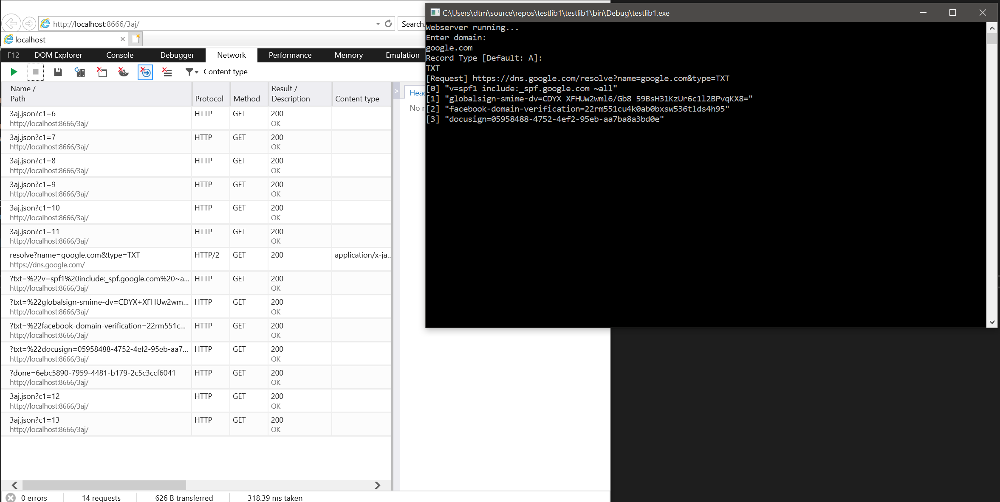
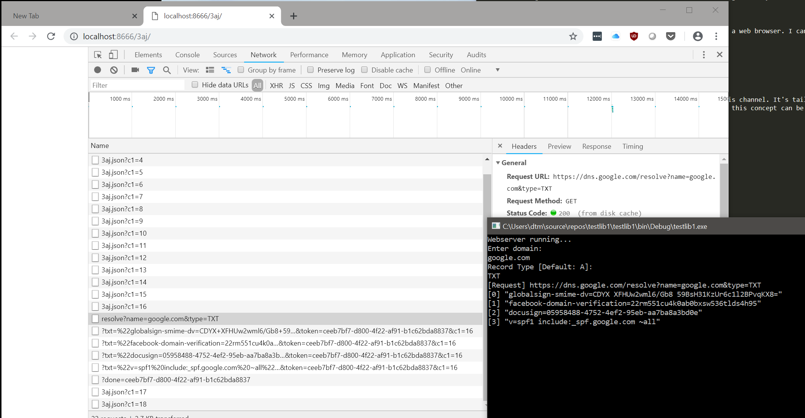

# 3ajlib

A proof of concept that demonstrates a method of sending/receiving data from .NET via a legitimate browser process of your choosing.

## Introduction

There are situations where a red teamer may want to have more control over the specific origin of their traffic on a system. Defensive tools such as [JA3](https://github.com/salesforce/ja3) and other EDR product components can identify known bad and contribute to building up a risk score based on the aspects of the web client being used to send data. I played around with JA3 and looked at the results for some of the typical web clients that are used. On the whole there was nothing too alarming, since lots of legitimate software uses the same methods. That said a JA3 hash of a client can contribute to a wider mechanism/set of metrics for filtering/determing a risk score for connections. Equally EDR products may look at the process responsible for sending traffic. I set out thinking of a way I can control which client sends data and where better to start than a legitimate web browser or in fact any of them.

## Idea

I can set up a sort of local IPC over HTTP between .NET and a web browser. I can then use JavaScript to handle a) communications outbound b) communications to my software.

In an attack scenario this would look something like this:

## What does this proof of concept do?

This proof of concept introduces a library which sets up this channel. It's tailored towards my work on [DoHC2](https://github.com/SpiderLabs/DoHC2) and currently the test client does DNS resolution via Google's DNS over HTTPS endpoint. In reality this concept can be extended to talk to any endpoint which presents a 'Access-Control-Allow-Origin' header which permits the localhost endpoint used.

## Demo

Demo showing DNS over HTTPS resolution via Internet Explorer:

Demo showing DNS over HTTPS resolution via Chrome:

## Authors

* **David Middlehurst** - Twitter- [@dtmsecurity](https://twitter.com/dtmsecurity)

## License

MIT

## Acknowledgments

* [Simple C# Web Server](https://codehosting.net/blog/BlogEngine/post/Simple-C-Web-Server)
